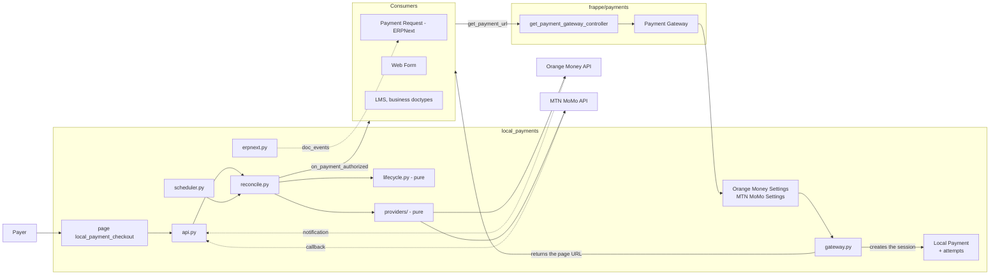
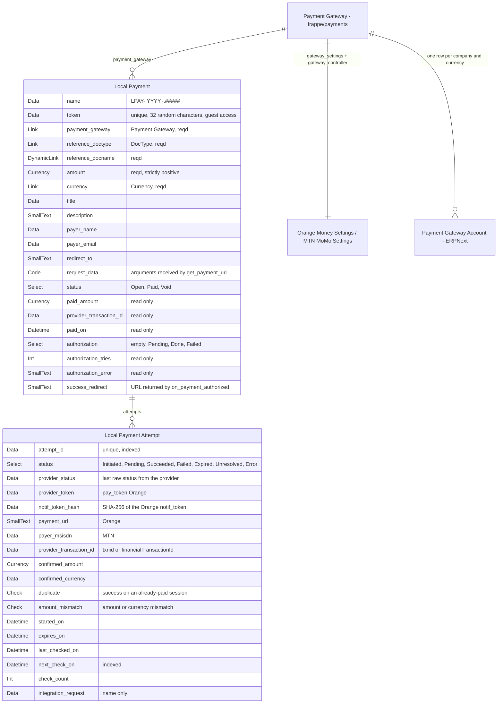
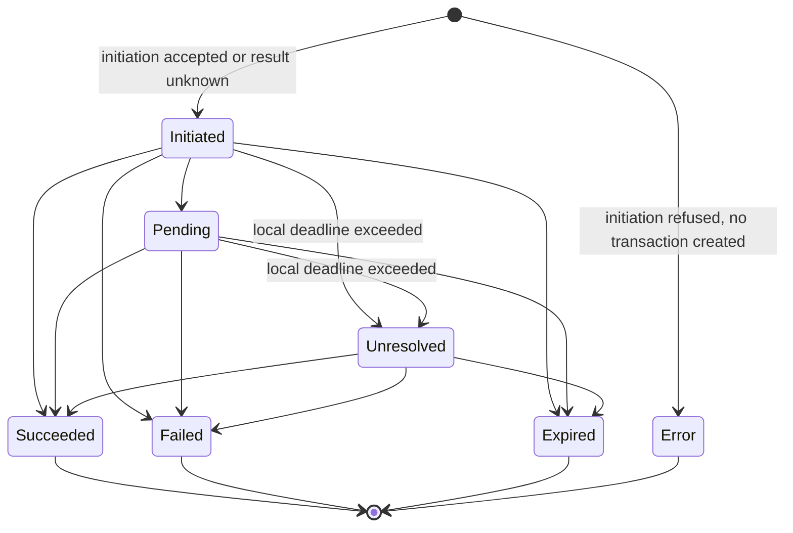
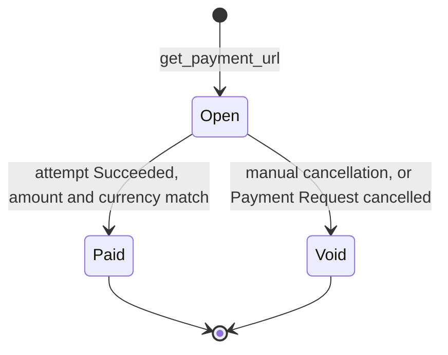

# Architecture — `local_payments`

`local_payments` adds Orange Money and MTN MoMo to the gateways of `frappe/payments`.
The app installs and behaves the same way on every Frappe site: from one site to
another, only the merchant credentials change. Any document or app that already
accepts a `frappe/payments` gateway (ERPNext Payment Request, Web Form, LMS,
business doctype) can offer these two payment methods without adaptation.

Provider-specific detail is found in [`gateways/orange-money.md`](gateways/orange-money.md) and [`gateways/mtn-momo.md`](gateways/mtn-momo.md).

## Scope

| Included in v1                                                                                             | Excluded from v1                                    |
| ---------------------------------------------------------------------------------------------------------- | --------------------------------------------------- |
| Orange Money Web Payment, "Group" offer: payment page hosted by Orange, OTP (One-Time Password) validation | Orange Money "Local/USSD"                           |
| MTN MoMo Collection, RequestToPay operation: request sent to the payer's phone                             | Refunds, disbursements, recurring payments          |
| Automatic completion of ERPNext Payment Requests                                                           | Provider selection by the payer on the payment page |
| Frappe v15 and v16, ERPNext optional                                                                       | Accounting entry made directly by the application   |

## Context and constraints

- **The common contract.** `frappe/payments` expects a `<Provider> Settings`
  doctype exposing `validate_transaction_currency()` and `get_payment_url(**kwargs)`.
  Once payment is secured, the gateway calls `on_payment_authorized(status)` on
  the document designated by `reference_doctype` / `reference_docname`. This is
  the only contract shared by all consumers (ADR 0001).
- **`frappe/payments` does not publish versions.** It is tracked by branch
  (`version-15`, `version-16`) or pinned by SHA. MIT license.
- **ERPNext is optional.** When installed, `Payment Request` does not implement
  `on_payment_authorized` (frappe/payments#204): a successful payment does not
  finalize it without intervention (ADR 0002).
- **Providers are outside the site's control.** Their notifications can be
  missing, arrive multiple times, or be forged.
- **Load assumption.** A few hundred payments per day per site at most. The
  scheduled sweep and row locks are sized for this order of magnitude.

## Overview

## Components

| Module                                     | Role                                                                                                     | Imports Frappe |
| ------------------------------------------ | -------------------------------------------------------------------------------------------------------- | -------------- |
| `providers/orange_money.py`              | Orange Money HTTP client: OAuth2 token, initiation, status. Normalizes responses into`ProviderResult`. | no             |
| `providers/mtn_momo.py`                  | MTN MoMo HTTP client: token, RequestToPay, status.                                                       | no             |
| `lifecycle.py`                           | States and transitions of sessions and attempts, amount and currency checks, duplicate detection.        | no             |
| `gateway.py`                             | Implementation of the`frappe/payments` contract, inherited by both Settings doctypes.                  | yes            |
| `api.py`                                 | Guest endpoints: starting an attempt, status, notifications.                                             | yes            |
| `reconcile.py`                           | Queries the provider, applies the transition under lock, triggers authorization.                         | yes            |
| `erpnext.py`                             | Payment Request finalization. Inactive without ERPNext.                                                  | yes            |
| `scheduler.py`                           | Sweep of open attempts and retry of failed authorizations.                                               | yes            |
| `templates/pages/local_payment_checkout` | Single payment page for both providers.                                                                  | yes            |

CI refuses any import of `frappe` in `providers/` and `lifecycle.py`. These
modules are tested without a site, using recorded HTTP responses.

## Structuring decisions

### D1. Integration via the native `frappe/payments` contract

Both providers are ordinary `frappe/payments` gateways, selectable anywhere a
gateway already is. MTN MoMo, which works via a push request to the phone, is
placed behind the same local page as Orange Money. Options discarded and
consequences: [ADR 0001](decisions/0001-native-payments-contract.md).

### D2. `get_payment_url()` never contacts the provider

`get_payment_url()` creates a `Local Payment` session and returns the URL of
the local page. The provider is only called when the payer acts on that page.
Displaying the page (GET) has no side effect: an attempt only starts on an
explicit action (POST).

*Why.* ERPNext calls `get_payment_url()` in the Payment Request's
`before_submit`, then emails the link. An Orange payment token expires in a
few minutes and an `order_id` can only carry a single token: a provider link
created at submission time would be unusable by the time it's clicked. The
call also happens inside the consumer's transaction, where
`create_request_log()` would run a `commit` that would partially validate the
submission. Finally, email gateways open received links to scan them: a page
that started a payment on display would consume attempts.

*Discarded.* Calling the provider inside `get_payment_url()` and returning its URL.

*Cost.* A page to maintain, and one more click for Orange Money.

### D3. Only a site-initiated status query is authoritative

Browser return, Orange notification, MTN callback, page-initiated query, and
scheduled sweep are only triggers. All of them lead to `reconcile()`, which
queries the provider's status API with the merchant's credentials and only
records what that response contains.

*Why.* The parameters of a return URL can be modified by the payer. The MTN
callback is sent only once, with no retry, and carries no secret. The Orange
notification is authenticated by a token specific to the attempt, but its
schema is not published. A merchant-authenticated query is the only signal
that no one else can produce.

*Discarded.* Confirming a payment based on the content of a notification or a
return URL.

*Cost.* One outbound call per trigger. Three mechanisms bound it: a minimum
interval between two queries of the same attempt, `rate_limit` on guest
endpoints, and, for Orange, verification of the `notif_token` before any call.

### D4. The fact of payment is recorded before the business effect

When an attempt succeeds, the session moves to `Paid` in a first transaction,
committed immediately. `on_payment_authorized()` then runs in a second
transaction, under the session row's lock. On success, its effects and
`authorization = Done` are committed together. On failure, its effects are
rolled back, `authorization` moves to `Failed` with the error, and the
scheduler retries the authorization.

*Why.* Money is received regardless of the fate of the business effect. A
rejected Payment Entry (closed accounting period, missing account) must not
erase the proof of payment. The lock guarantees that a second trigger finds
`Done` and does not run the callback a second time.

*Discarded.* Doing everything in a single transaction: a consumer failure
would roll back the recording of a real payment.

*Cost.* A visible intermediate state (paid, authorization pending) and a
retry mechanism.

### D5. One settings document per merchant contract

`Orange Money Settings` and `MTN MoMo Settings` are not Single doctypes. Each
document represents a merchant contract, named by `gateway_name`. On save, it
creates the `Orange Money-<gateway_name>` or `MTN MoMo-<gateway_name>` gateway,
whose `gateway_controller` points to it, then emits `payment_gateway_enabled`.
Stripe, Braintree, and M-Pesa follow the same pattern in `frappe/payments`.

Attachment to a company is handled by the ERPNext `Payment Gateway Account`
doctype (company, cash account, currency). On receiving
`payment_gateway_enabled`, ERPNext creates this account for the default company.

*Why.* A site may hold several contracts: multiple companies, or sandbox and
production. The accounting attachment already exists in ERPNext.

*Discarded.* A Single doctype, which would limit the site to one contract. A
`company` field on the settings, which would duplicate `Payment Gateway Account`.

*Cost.* For a company other than the default company, the `Payment Gateway Account` is created manually.

### D6. Payment Requests are finalized by a hook

`local_payments` registers `on_payment_authorized` on `Payment Request` via
`doc_events`, for its own gateways only, and calls `set_as_paid()`: it is
ERPNext that creates the Payment Entry. Idempotency guard and version-upgrade
risk: [ADR 0002](decisions/0002-payment-request-authorization-hook.md).

### D7. A pure core, thin adapters

The provider clients and transition rules do not import Frappe. All access to
the database, cache, task queue, or permissions goes through the adapters.

*Why.* The rules that decide a payment is secured can be tested in
milliseconds, without a site. A change in a provider's API stays confined to
a single file; Orange Money in Cameroon recently forced its integrators to
change credentials and endpoints.

*Discarded.* Writing HTTP calls in doctype controllers.

*Cost.* A translation layer between pure objects and Frappe documents.

## Data model

| Doctype                                 | Role                                                                                                    |
| --------------------------------------- | ------------------------------------------------------------------------------------------------------- |
| `Orange Money Settings`               | A merchant contract with Orange Money. Fields:[orange-money.md](gateways/orange-money.md#configuration). |
| `MTN MoMo Settings`                   | A merchant contract with MTN MoMo. Fields:[mtn-momo.md](gateways/mtn-momo.md#configuration).             |
| `Local Payment`                       | A session: what a consumer requests be paid, and its outcome.                                           |
| `Local Payment Attempt` (child table) | An attempt with the provider, its identifiers and its latest status.                                    |

Reused without modification: `Payment Gateway` (`frappe/payments`),
`Integration Request` (Frappe), `Payment Gateway Account` (ERPNext).

`Integration Request` serves as a network log: one row per attempt, with the
raw request and response. Frappe purges it after 90 days by default (Log
Settings). The attempt is therefore only linked to it by name, without a
`Link`, and durable proof (transaction id, confirmed amount, final status) is
carried by the attempt itself.

`attempt_id` is the identifier sent to the provider: `order_id` for Orange
Money, `X-Reference-Id` for MTN MoMo. It is generated by the application for
each attempt. Any `order_id` supplied by the consumer is kept in
`request_data` and is never sent to the provider.

## Lifecycle

### Attempt

`Unresolved` means the local deadline has passed while the provider has not
returned a final state. The attempt continues to be queried at a decreasing
frequency for 72 hours, then an alert is sent to `Local Payments Manager`. A
late success is still applied.

### Session

Rules enforced by `lifecycle.py`:

- A session has at most one `Initiated` or `Pending` attempt. A new attempt is
  only possible after the previous one has moved to a final state or to
  `Unresolved`.
- A successful attempt on a session already `Paid` is marked `duplicate`. The
  session does not change and an alert is issued. No refund is automatic.
- A successful attempt whose amount or currency differs from the session is
  marked `amount_mismatch`. The session stays `Open` and an alert is issued.
- No transition returns from a final state.

## Contract with consumers

**Input.** `get_payment_url(**kwargs)` receives at minimum `amount`,
`currency`, `reference_doctype`, `reference_docname`, and, depending on the
consumer, `title`, `description`, `payer_name`, `payer_email`, `order_id`,
`redirect_to`, and `payment_gateway`. All of it is kept in `request_data`. If
an `Open` session already exists for the same reference, the same gateway, the
same amount, and the same currency, its URL is returned instead of creating a
second one.

**Callback.** When the session moves to `Paid`, the application calls
`run_method("on_payment_authorized", "Completed")` on the reference document.
Just before that, `frappe.flags.data` receives `request_data`, supplemented
with `payment_gateway`, `provider_transaction_id`, and `order_id` replaced by
the `attempt_id` of the successful attempt, which is unique per payment. The
PayPal and Razorpay gateways also populate `frappe.flags.data`. LMS uses it to
identify the payment.

**Consumer obligations.**

- The callback can run in a Guest context (payment page), as a logged-in user,
  or as Administrator (scheduler). It must not depend on
  `frappe.session.user`.
- The callback can be replayed after a failure. It must be idempotent.
- A URL returned by `on_payment_authorized` replaces `redirect_to`, as with
  other gateways.

**Payer exit.** After payment, the page redirects to `payment-success`,
`payment-failed`, or `payment-cancel`, pages provided by `frappe/payments`.

## Entry points

| Entry point                                                 | Method    | Access                     | Effect                                                                                       |
| ----------------------------------------------------------- | --------- | -------------------------- | -------------------------------------------------------------------------------------------- |
| `/local_payment_checkout?token=…`                        | GET       | guest                      | Displays the session. No side effect.                                                        |
| `local_payments.api.start_attempt(token, msisdn=None)`    | POST      | guest,`rate_limit`       | Creates an attempt and calls initiation. Returns the Orange URL, or the MTN waiting state.   |
| `local_payments.api.get_status(token)`                    | GET       | guest,`rate_limit`       | Triggers`reconcile()` if the minimum interval has elapsed. Returns the state and exit URL. |
| `local_payments.api.orange_money_notification(attempt)`   | POST      | guest                      | Verifies the`notif_token`, then queues `reconcile()`.                                    |
| `local_payments.api.mtn_momo_callback(attempt)`           | PUT, POST | guest,`rate_limit`       | Queues`reconcile()`.                                                                       |
| `Local Payment` form: Verify, Retry authorization, Cancel | button    | `Local Payments Manager` | Support actions.                                                                             |

## Scheduled tasks

| Frequency                  | Task                                                                                                            |
| -------------------------- | --------------------------------------------------------------------------------------------------------------- |
| Every 2 minutes (`cron`) | `Initiated` and `Pending` attempts whose `next_check_on` is due.                                          |
| Every hour                 | `Unresolved` attempts. `Pending` or `Failed` authorizations, with spaced-out retries.                     |
| Every day                  | Alerts: attempts`Unresolved` for more than 72 hours, authorizations failed after the maximum number of tries. |

## Security and permissions

- Merchant credentials are stored in `Password` fields, encrypted with the
  site's `encryption_key`. The Settings doctypes are restricted to System
  Manager.
- `Local Payment` is readable by `Local Payments Manager`, a role created by
  the application, and by System Manager. The document is only created by
  code and can only be deleted by Administrator. Its status fields are
  read-only and are only written by `reconcile()`.
- Guest access to a session goes solely through its `token`. The sequential
  name is never exposed. The page only displays the title, amount, currency,
  and provider.
- The payer's phone number is personal data, visible only to the roles above.
- The Orange `notif_token` is stored hashed.
- Provider access tokens are cached per settings document until their
  announced expiration, and renewed on a 401 response.

## Refused by design

- A non-integer amount in a currency with no subunit (XAF) is rejected at
  session creation, never rounded.
- A currency other than the one configured for the gateway is rejected by
  `validate_transaction_currency()` and by `get_payment_url()`. The Web Form
  does not call the former.
- A disabled gateway refuses `get_payment_url()`.
- A notification or callback for an unknown attempt is ignored, with no
  outbound call.
- An Orange notification whose `notif_token` does not match is ignored, with
  no outbound call.
- An MTN number outside the format of the configured country is rejected
  before any call.
- An attempt on a `Paid` or `Void` session is refused.
- A new attempt is refused as long as another one is `Initiated` or
  `Pending`. For Orange Money, the page then returns the URL of the ongoing
  attempt.
- A success whose amount or currency differs from the session does not mark
  it paid.
- A second success on a paid session is logged as a duplicate, never applied
  a second time.

## Installation and configuration

1. `bench get-app payments --branch version-16` (or `version-15`), then
   `bench get-app local_payments`.
2. `bench --site <site> install-app payments local_payments`.
3. Create an `Orange Money Settings` or `MTN MoMo Settings` document per
   merchant contract, with its credentials. The gateway appears in
   `Payment Gateway`.
4. On an ERPNext site, check the `Payment Gateway Account` created for the
   default company, and create one for each other company involved.
5. For MTN MoMo in production, register the site's callback host in the MTN
   merchant portal.

Nothing else varies from one site to another.

## Known weaknesses

- **The Orange Money technical contract is not public.** The endpoints and
  schemas described in `orange-money.md` must be validated in sandbox,
  against the documentation provided to the merchant, before going to
  production.
- **The expiration delay of a pending MTN request is not documented.** It is
  configurable. A value that is too short produces `Unresolved` attempts,
  never a lost payment.
- **The Orange status response does not return the amount.** Amount
  verification relies on the `amount` parameter of the status request.
- **A session is tied to a single gateway.** The payer cannot switch
  providers on the page; the consumer must offer each gateway separately.
  This is a limitation of the `frappe/payments` contract.
- **The Payment Entry created by ERPNext does not carry the provider's
  transaction id.** It references the Payment Request, which is itself
  referenced by the session that carries this identifier.
- **`frappe/payments` evolves without a published version.** A new gateway
  interface (`PaymentController`, `Payment Session Log`) is already called by
  ERPNext's `develop` branch, but is not shipped by any branch of
  `frappe/payments`. Status: to watch (ADR 0001).
- **No refunds.** A duplicate or an amount mismatch is handled outside the
  application.

## Related documents

- [`gateways/orange-money.md`](gateways/orange-money.md): Orange Money Web Payment contract.
- [`gateways/mtn-momo.md`](gateways/mtn-momo.md): MTN MoMo Collection contract.
- [`decisions/0001-native-payments-contract.md`](decisions/0001-native-payments-contract.md)
- [`decisions/0002-payment-request-authorization-hook.md`](decisions/0002-payment-request-authorization-hook.md)
