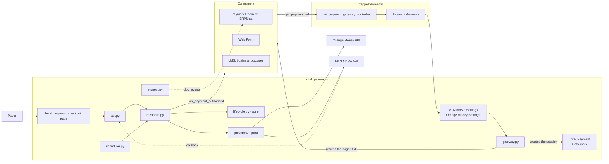
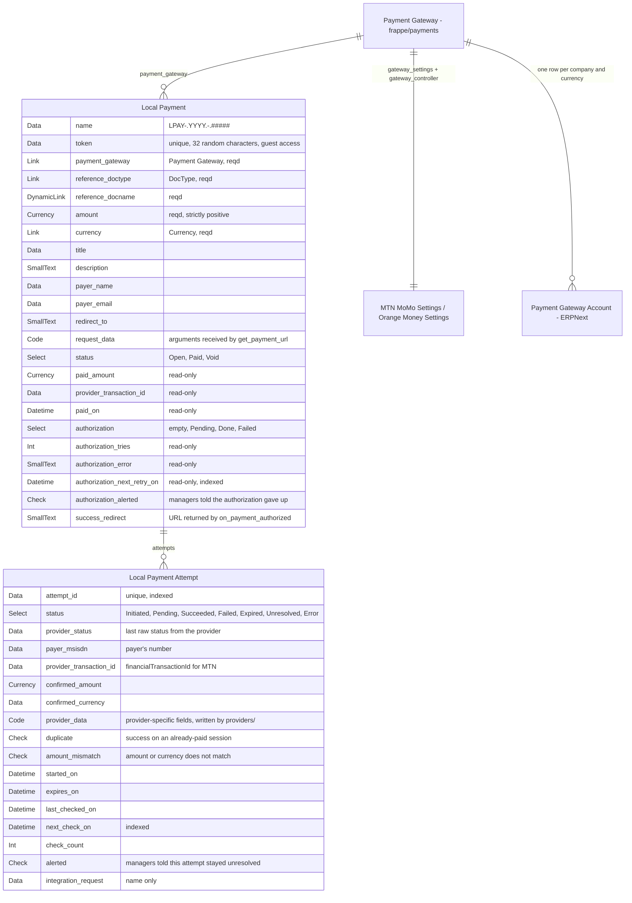
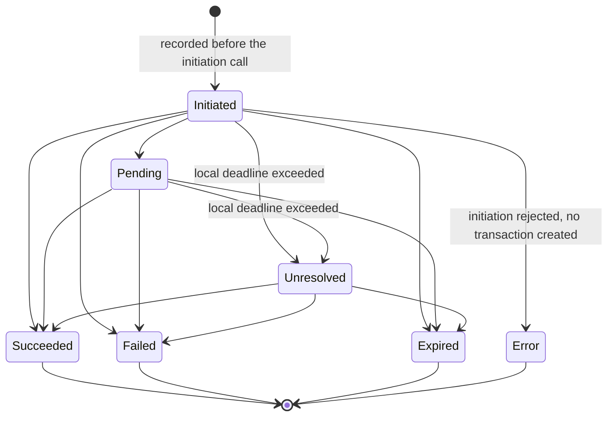
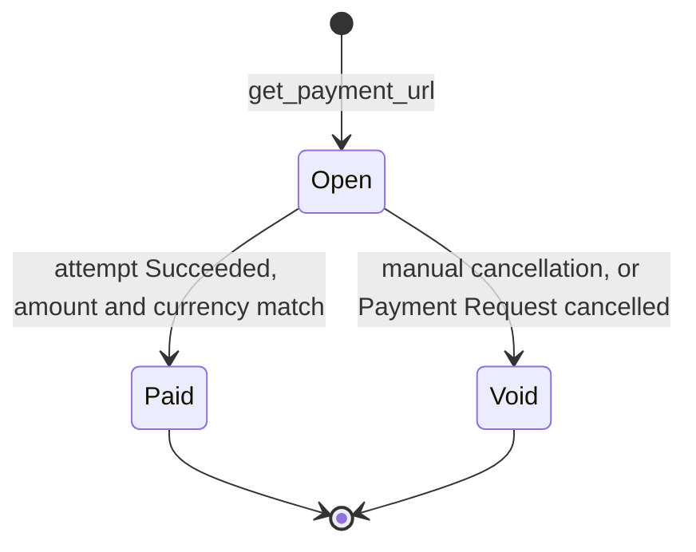

# Architecture — `local_payments`

`local_payments` adds local mobile payment methods to `frappe/payments`
gateways. MTN MoMo and Orange Money are the two gateways in the v1 scope,
implemented in this order: MTN MoMo first, then Orange Money Local/USSD,
once its merchant contract and technical documentation are available. The
application installs and behaves the same way on any Frappe site: from one
site to another, only the merchant credentials change. Any document or
application that already accepts a `frappe/payments` gateway (ERPNext's
Payment Request, Web Form, LMS, business doctype) can offer these payment
methods with no adaptation.

Provider-specific detail is found in
[`gateways/mtn-momo.md`](gateways/mtn-momo.md) and
[`gateways/orange-money.md`](gateways/orange-money.md).

## Scope

| Included in v1                                                                 | Excluded                                         |
| ------------------------------------------------------------------------------ | ------------------------------------------------ |
| MTN MoMo Collection, RequestToPay operation: request sent to the payer's phone | Orange Money Web Payment (redirect, OTP)         |
| Orange Money Local/USSD: same principle, request sent to the payer's phone     | Refunds, disbursements, recurring payments       |
| Automatic finalization of ERPNext Payment Requests                             | Provider choice by the payer on the payment page |
| Frappe v16                                                                    |                                                  |

The data model, the lifecycle, and the payment page are common to both
providers. What remains specific to Orange Money — a settings doctype and
an HTTP client — is covered in
[`gateways/orange-money.md`](gateways/orange-money.md), which tracks the
progress of its merchant contract.

## Context and constraints

- **The common contract.** `frappe/payments` expects a `<Provider> Settings`
  doctype that exposes `validate_transaction_currency()` and
  `get_payment_url(**kwargs)`. Once the payment is secured, the gateway
  calls `on_payment_authorized(status)` on the document designated by
  `reference_doctype` / `reference_docname`. This is the only contract
  shared by all consumers (ADR 0001).
- **`frappe/payments` does not publish a version.** It is pinned by SHA
  on its `version-16` branch (`cca07d9f9392e2ea0e521c5975151db9e4b6c321`). MIT license.
- **ERPNext is optional.** When it is installed, `Payment Request` does not
  implement `on_payment_authorized` (frappe/payments#204): a successful
  payment does not finalize it without intervention (ADR 0002).
- **Providers are outside the site's control.** Their notifications can be
  missing, arrive several times, or be forged.
- **Load assumption.** A few hundred payments per day per site at most. The
  scheduled sweep and row locks are sized for this order of magnitude.

## Overview

## Components

| Module                                     | Role                                                                                                                                                                                                                          | Imports Frappe |
| ------------------------------------------ | ----------------------------------------------------------------------------------------------------------------------------------------------------------------------------------------------------------------------------- | -------------- |
| `providers/mtn_momo.py`                  | MTN MoMo HTTP client: token, RequestToPay, status. Normalizes responses into`ProviderResult`.                                                                                                                               | no             |
| `providers/orange_money.py`              | Orange Money HTTP client (Local/USSD): token, initiation, status. Normalizes responses into`ProviderResult`. Written after `providers/mtn_momo.py`, once the merchant contract and technical documentation are available. | no             |
| `lifecycle.py`                           | States and transitions for sessions and attempts, amount and currency checks, duplicate detection.                                                                                                                            | no             |
| `gateway.py`                             | Implementation of the`frappe/payments` contract, inherited by the Settings doctypes.                                                                                                                                        | yes            |
| `api.py`                                 | Guest endpoints: starting an attempt, status, callbacks.                                                                                                                                                                      | yes            |
| `reconcile.py`                           | Queries the provider, applies the transition under lock, triggers authorization.                                                                                                                                              | yes            |
| `erpnext.py`                             | Finalization of Payment Requests. Inactive without ERPNext.                                                                                                                                                                   | yes            |
| `scheduler.py`                           | Sweep of open attempts and retry of failed authorizations.                                                                                                                                                                    | yes            |
| `templates/pages/local_payment_checkout` | Payment page, common to all providers.                                                                                                                                                                                        | yes            |

CI rejects any import of `frappe` in `providers/` and `lifecycle.py`. These
modules are tested without a site, using recorded HTTP responses.

## Structuring decisions

### D1. Integration through the native `frappe/payments` contract

Providers are ordinary `frappe/payments` gateways, selectable everywhere a
gateway is already selectable. MTN MoMo, which works by pushing a request to
the phone, sits behind a local page served by the application. Orange Money
Local/USSD follows the same principle behind the same page. Options ruled
out and consequences: [ADR 0001](decisions/0001-native-payments-contract.md).

### D2. `get_payment_url()` never contacts the provider

`get_payment_url()` creates a `Local Payment` session and returns the URL of
the local page. The provider is called only when the payer acts on that
page. Displaying the page (GET) has no side effect: an attempt only starts
on an explicit action (POST).

*Why.* ERPNext calls `get_payment_url()` in the Payment Request's
`before_submit`, then sends the link by email. A push request created at
that moment would reach the payer's phone when the invoice is submitted,
unrelated to when they decide to pay, and would expire before then. The
call also happens inside the consumer's transaction, where
`create_request_log()` would run a `commit` that would partially validate
the submission. Finally, mail gateways open received links to scan them: a
page that started a payment on display would consume attempts.

*Ruled out.* Calling the provider inside `get_payment_url()` and returning
its URL or reference.

*Cost.* A page to maintain.

### D3. Only a status query initiated by the site counts as proof

Browser return, provider callback, page polling, and scheduled sweep are
only triggers. All of them lead to `reconcile()`, which queries the
provider's status API with the merchant's credentials and records only what
that response contains.

*Why.* The parameters of a return URL can be modified by the payer. The MTN
callback is sent only once, with no retry, and carries no secret. A query
authenticated by the merchant is the only signal that no one else can
produce.

*Ruled out.* Confirming a payment based on the content of a callback or a
return URL.

*Cost.* One outgoing call per trigger. Two mechanisms bound it: a minimum
interval between two queries of the same attempt, and `rate_limit` on the
guest endpoints.

### D4. The fact of payment is recorded before the business effect

When an attempt succeeds, the session moves to `Paid` in a first
transaction, committed immediately. `on_payment_authorized()` then runs in a
second transaction, under a lock on the session row. On success, its
effects and `authorization = Done` are committed together. On failure, its
effects are rolled back, `authorization` moves to `Failed` with the error,
and the scheduler retries the authorization.

*Why.* The money is received regardless of the outcome of the business
effect. A rejected Payment Entry (closed accounting period, missing
account) must not erase the proof of payment. The lock guarantees that a
second trigger finds `Done` and does not run the callback a second time.

*Ruled out.* Doing everything in a single transaction: a failure on the
consumer's side would roll back the record of a real payment.

*Cost.* A visible intermediate state (paid, authorization pending) and a
retry mechanism.

### D5. One settings document per merchant contract

`MTN MoMo Settings`, and later `Orange Money Settings`, are not Single
doctypes. Each document represents one merchant contract, named by
`gateway_name`. On save, it creates the `<Provider>-<gateway_name>` gateway,
whose `gateway_controller` points back to it, then emits
`payment_gateway_enabled`. Stripe, Braintree, and M-Pesa follow the same
pattern in `frappe/payments`.

Linking to a company is handled by ERPNext's `Payment Gateway Account`
doctype (company, cash account, currency). On receiving
`payment_gateway_enabled`, ERPNext creates this account for the default
company.

*Why.* A site can hold several contracts: several companies, or sandbox and
production. The accounting link already exists in ERPNext.

*Ruled out.* A Single doctype, which would limit the site to one contract.
A `company` field on the settings, which would duplicate
`Payment Gateway Account`.

*Cost.* For a company other than the default one, the
`Payment Gateway Account` is created by hand.

### D6. Payment Requests are finalized by a hook

`local_payments` registers `on_payment_authorized` on `Payment Request` via
`doc_events`, only for its own gateways, and calls `set_as_paid()`: ERPNext
is the one that creates the Payment Entry. Idempotency guard and
version-upgrade risk:
[ADR 0002](decisions/0002-payment-request-authorization-hook.md).

### D7. A pure core, thin adapters

The provider clients and the transition rules do not import Frappe. Any
access to the database, the cache, the task queue, or permissions goes
through the adapters.

*Why.* The rules that decide a payment is secured can be tested in
milliseconds, without a site. An API change at a provider stays confined to
one file; Orange Money in Cameroon recently forced a change of credentials
and endpoints on its integrators.

*Ruled out.* Writing the HTTP calls inside doctype controllers.

*Cost.* A translation layer between pure objects and Frappe documents.

### D8. The attempt schema is shared, provider-specific detail is kept separate

`Local Payment Attempt` carries as typed columns what the application reads
itself: the fields carried by `ProviderResult`, those used by the
scheduler's queries, and those shown to support. Any other field specific
to a provider is serialized in `provider_data`, written and read back only
by the relevant `providers/` module.

*Why.* Push-request collection modes look alike from one provider to
another: a number, an approval on the phone, a status query. What differs
(format of the transmitted identifier, raw status vocabulary, headers) is
read by no code outside the HTTP client. A column per quirk per provider
would fill the doctype with empty fields for every other provider.

*Ruled out.* An attempt doctype per provider, which would force
`reconcile()` and the scheduler to query several tables and would duplicate
the notion of a current attempt. Putting everything in `provider_data`,
which would take away support's ability to search and filter on the
transaction identifier and the payer's number.

*Cost.* `provider_data` is not constrained by the schema. Each provider
module defines the structure it writes there as a dataclass, in the pure
core, so the content stays typed and testable.

## Data model

| Doctype                                 | Role                                                                                                                                          |
| --------------------------------------- | --------------------------------------------------------------------------------------------------------------------------------------------- |
| `MTN MoMo Settings`                   | One MTN MoMo merchant contract. Fields:[mtn-momo.md](gateways/mtn-momo.md#configuration).                                                      |
| `Orange Money Settings`               | One Orange Money merchant contract. Fields to be defined once the documentation is received — see[orange-money.md](gateways/orange-money.md). |
| `Local Payment`                       | A session: what a consumer asks to be paid, and its outcome.                                                                                  |
| `Local Payment Attempt` (child table) | One attempt with the provider, its identifiers, and its latest status.                                                                        |

Reused without modification: `Payment Gateway` (`frappe/payments`),
`Integration Request` (Frappe), `Payment Gateway Account` (ERPNext).

`Integration Request` serves as the network log: one row per attempt, with
the initiation request as sent and the provider's answer to each send (two
after a token renewal). Headers that carry credentials and the token request
are never logged. Status queries are not logged there: their outcome is on
the attempt (`provider_status`), their failures in Error Log. Frappe purges
it after 90 days by default (Log Settings). The attempt is therefore linked
to it only by name, with no `Link`, and the durable proof (transaction
identifier, confirmed amount, final status) is carried by the attempt
itself.

`attempt_id` is the identifier transmitted to the provider: `X-Reference-Id`
for MTN MoMo. It is generated by the application for each attempt. The
format expected by Orange Money is still to be confirmed against its
technical documentation. The `order_id`, if supplied by the consumer, is
kept in `request_data` and is never transmitted to the provider.

## Lifecycle

### Attempt

An attempt is saved as `Initiated`, and committed, before the initiation call,
so a timeout or a crash still leaves an `attempt_id` that can be queried.
No trigger queries it before its first check date, set past the longest
initiation call and brought forward once the provider has answered: a status
query sent before the provider has seen the request could read as `Failed`.
`Initiated` stays when the provider accepts the request or when the outcome
is unknown. `Error` is decided locally when the provider refuses it: no
status check ever reports it.

`Unresolved` means the local deadline has passed while the provider has not
returned a final state. The attempt keeps being queried at a decreasing
frequency for 72 hours, after which an alert is sent to
`Local Payments Manager`. A late success is still applied.

### Session

Rules carried by `lifecycle.py`:

- A session has at most one `Initiated` or `Pending` attempt. A new attempt
  is only possible after the previous one has moved to a final state or to
  `Unresolved`.
- A successful attempt on a session already `Paid` is marked `duplicate`.
  The session does not change and an alert is raised. No refund is
  automatic.
- A successful attempt whose amount or currency differs from the session is
  marked `amount_mismatch`. The session stays `Open` and an alert is
  raised.
- No transition returns from a final state.

## Contract with consumers

**Input.** `get_payment_url(**kwargs)` receives at minimum `amount`,
`currency`, `reference_doctype`, `reference_docname`, and, depending on the
consumer, `title`, `description`, `payer_name`, `payer_email`, `order_id`,
`redirect_to`, and `payment_gateway`. All of it is kept in `request_data`.
If an `Open` session already exists for the same reference, the same
gateway, the same amount, and the same currency, its URL is returned
instead of creating a second one.

**Callback.** When the session moves to `Paid`, the application calls
`run_method("on_payment_authorized", "Completed")` on the reference
document. Just before that, `frappe.flags.data` receives `request_data`,
extended with `payment_gateway`, `provider_transaction_id`, and `order_id`
replaced by the `attempt_id` of the successful attempt, which is unique per
payment. The PayPal and Razorpay gateways also populate
`frappe.flags.data`. LMS uses it to identify the payment.

**Consumer obligations.**

- The callback can run in a Guest context (payment page), a logged-in user
  context, or Administrator (scheduler). It must not depend on
  `frappe.session.user`.
- The callback can be replayed after a failure. It must be idempotent.
- A URL returned by `on_payment_authorized` replaces `redirect_to`, as with
  the other gateways.

**Payer exit.** After payment, the page redirects to `payment-success`,
`payment-failed`, or `payment-cancel`, pages provided by `frappe/payments`.

## Entry points

| Entry point                                                | Method    | Access                     | Effect                                                                                           |
| ---------------------------------------------------------- | --------- | -------------------------- | ------------------------------------------------------------------------------------------------ |
| `/local_payment_checkout?token=…`                       | GET       | guest                      | Displays the session. No side effect.                                                            |
| `local_payments.api.start_attempt(token, msisdn)`        | POST      | guest,`rate_limit`       | Checks the number, creates an attempt and calls initiation. Returns the same state as `get_status`. |
| `local_payments.api.get_status(token)`                   | GET       | guest,`rate_limit`       | Triggers`reconcile()` if the minimum interval has elapsed. Returns the state and the exit URL. |
| `local_payments.api.mtn_momo_callback?attempt=…`         | PUT, POST | guest,`rate_limit`       | Queues`reconcile()`, at most one job per attempt. Unknown or settled attempt: same empty answer, nothing queued. |
| `Local Payment` form: Check, Retry authorization, Cancel | button    | `Local Payments Manager` | Support actions.                                                                                 |

The entry point specific to Orange Money Local/USSD (callback or
notification, form still unknown) will be added to this table once its
documentation is received.

## Scheduled tasks

| Frequency                  | Task                                                                                                                                                                                          |
| -------------------------- | ----------------------------------------------------------------------------------------------------------------------------------------------------------------------------------------------- |
| Every 2 minutes (`cron`) | `Initiated` and `Pending` attempts whose `next_check_on` is due. `reconcile()` on each.                                                                                              |
| Every hour                 | `Unresolved` attempts whose `next_check_on` is due, until 72 hours after their deadline. `Pending` or `Failed` authorizations whose `authorization_next_retry_on` is due.            |
| Every day                  | Alerts to `Local Payments Manager`, sent once: attempts `Unresolved` for more than 72 hours on a session still `Open`, authorizations still `Failed` after the maximum number of tries. |

The jobs decide nothing. `reconcile()` writes the next due date each time it records an outcome:
decreasing frequency for an `Unresolved` attempt, a doubling backoff for a failed authorization, and no
date at all once an attempt is settled or an authorization has used up its tries. Each job is therefore a
comparison on one indexed column, and selecting is the same thing as filtering: a job that read a batch and
then dropped what is not due yet would let items that are never due crowd out the ones that are.

Each run takes a bounded batch, oldest due date first, and processes items one at a time: an exception on
one is logged in Error Log and the others still run. What a run does not reach is picked up by the next one.
The two daily alerts are recorded by a flag on the row, so a repeat run selects nothing.

## Security and permissions

- Merchant credentials are stored in `Password` fields, encrypted with the
  site's `encryption_key`. The Settings doctypes are restricted to System
  Manager.
- `Local Payment` is readable by `Local Payments Manager`, a role created
  by the application, and by System Manager. The document is only ever
  created by code and can only be deleted by Administrator. Its status
  fields are read-only and are written only by `reconcile()`.
- Guest access to a session only ever goes through its `token`. The
  sequential name is never exposed. The page shows only the title, the
  amount, the currency, and the provider.
- The payer's phone number is personal data, visible only to the roles
  above.
- `provider_data` contains no secret. A token tied to an attempt is stored
  there hashed.
- Provider access tokens are cached per settings document until their
  announced expiry, and renewed on a 401 response.

## Rejected by design

- A non-integer amount in a currency with no sub-unit (XAF) is rejected
  when the session is created, never rounded.
- A currency other than the one configured for the gateway is rejected by
  `validate_transaction_currency()` and by `get_payment_url()`. The Web
  Form does not call the former.
- A disabled gateway refuses `get_payment_url()`.
- A callback for an unknown attempt is ignored, with no outgoing call.
- A phone number outside the configured country's format is rejected
  before any call.
- An attempt on a `Paid` or `Void` session, or through a disabled gateway,
  is rejected.
- A new attempt is rejected as long as another one is `Initiated` or
  `Pending`.
- A success whose amount or currency differs from the session does not
  mark it paid.
- A second success on an already-paid session is logged as a duplicate,
  never applied a second time.

## Installation and configuration

1. `bench get-app payments --branch version-16`, then
   `git -C apps/payments checkout cca07d9f9392e2ea0e521c5975151db9e4b6c321`, then `bench get-app local_payments`.
2. `bench --site <site> install-app payments local_payments`.
3. Create one `MTN MoMo Settings` document per MTN merchant contract, then,
   once Orange Money is implemented, one `Orange Money Settings` document
   per Orange merchant contract. Each with its own credentials; the
   corresponding gateway appears in `Payment Gateway`.
4. On an ERPNext site, check the `Payment Gateway Account` created for the
   default company, and create one for each other company involved.
5. For MTN MoMo in production, register the site's callback host in the
   MTN merchant portal.

Nothing else varies from one site to another.

## Known weaknesses

- **The expiry delay for a pending MTN request is not documented.** It is
  configurable. A value that is too short produces `Unresolved` attempts,
  never a lost payment.
- **A session is tied to a single gateway.** The payer cannot switch
  providers on the page; the consumer must offer each gateway separately.
  This is a limitation of the `frappe/payments` contract.
- **The Payment Entry created by ERPNext does not carry the provider's
  transaction identifier.** It references the Payment Request, which is
  itself referenced by the session that carries that identifier.
- **`frappe/payments` evolves with no published version.** A new gateway
  interface (`PaymentController`, `Payment Session Log`) is already called
  by ERPNext's `develop` branch, but is not shipped by any branch of
  `frappe/payments`. Status: to watch (ADR 0001).
- **No refunds.** A duplicate or an amount mismatch is handled outside the
  application.
- **The Orange Money Local/USSD technical contract is not yet known.**
  Endpoints, the status schema, and the format of the transmitted
  identifier depend on the documentation delivered when the merchant
  contract is activated. Status of the work and items still needed:
  [`gateways/orange-money.md`](gateways/orange-money.md).

## Related documents

- [`gateways/mtn-momo.md`](gateways/mtn-momo.md): MTN MoMo Collection
  contract.
- [`gateways/orange-money.md`](gateways/orange-money.md): status of the
  Orange Money work and items to obtain before implementation.
- [`decisions/0001-native-payments-contract.md`](decisions/0001-native-payments-contract.md)
- [`decisions/0002-payment-request-authorization-hook.md`](decisions/0002-payment-request-authorization-hook.md)
