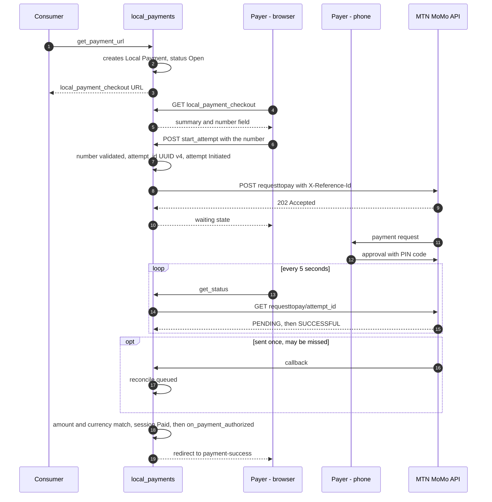

# MTN MoMo Gateway

This document describes the integration of MTN MoMo into `local_payments`:
configuration, operations called, status mapping, and rules specific to this
provider. Rules common to both gateways (session, attempt, reconciliation,
consumer callback) are in [`../ARCHITECTURE.md`](../ARCHITECTURE.md).

## Product

MTN MoMo Open API, Collection product, RequestToPay operation. The site sends
a payment request to the payer's MoMo account, identified by their MSISDN
(Mobile Station International Subscriber Directory Number). The payer
approves the request on their phone. The request stays pending until it is
approved, rejected, or expired by MTN.

MTN does not host a payment page. Entering the number and waiting happen on
the local `local_payment_checkout` page, shared by both gateways. The
contract seen by consumers is therefore identical to Orange Money's.

## Merchant prerequisites

- An account on the MTN MoMo developer portal, subscribed to the Collection
  product, for sandbox.
- Going to production with MTN Mobile Money Cameroon. The terms of use
  specific to Cameroon are published on the portal; the contact is
  `MoMoCorporate.CM@mtn.com`.
- After going to production, access to the MTN merchant portal. Production
  API keys are created there and the site's callback host is registered
  there. HTTPS is mandatory in production.

## Configuration

Doctype `MTN MoMo Settings`, not Single, named by `gateway_name`.

| Field | Type | Required | Role |
| --- | --- | --- | --- |
| `gateway_name` | Data | yes | Contract name. Gives its name to the document and to the `MTN MoMo-<gateway_name>` gateway. |
| `enabled` | Check | | A disabled gateway refuses `get_payment_url()`. |
| `environment` | Select: Sandbox, Production | yes | |
| `api_base_url` | Data | yes | Sandbox: `https://sandbox.momodeveloper.mtn.com`. Production: URL provided by MTN. |
| `target_environment` | Data | yes | Value of the `X-Target-Environment` header: `sandbox`, or the production value provided by MTN. |
| `currency` | Link: Currency | yes | Accepted currency: `XAF` in Cameroon. |
| `subscription_key` | Password | yes | Subscription key for the Collection product (`Ocp-Apim-Subscription-Key`). |
| `api_user` | Data | yes | API user identifier. |
| `api_key` | Password | yes | API user key. |
| `msisdn_prefix` | Data | yes | Country code without `+`: `237` for Cameroon. |
| `msisdn_national_length` | Int | yes | Length of the national number: 9 in Cameroon. |
| `pending_timeout_minutes` | Int | | Local delay before `Unresolved`. Defaults to 15. |
| `payer_message` | Data | | Message shown to the payer. At most 160 characters. |
| `payee_note` | Data | | Merchant-side note. At most 160 characters. |
| `send_callback` | Check | | Sends `X-Callback-Url`. Checked by default. |

## Operations

| Operation | Request | Useful response |
| --- | --- | --- |
| Access token | `POST {api_base_url}/collection/token/`, headers `Authorization: Basic base64(api_user:api_key)` and `Ocp-Apim-Subscription-Key` | `access_token`, `expires_in` |
| RequestToPay | `POST {api_base_url}/collection/v1_0/requesttopay`. Headers: Bearer token, `X-Reference-Id` (the `attempt_id`, UUID v4), `X-Target-Environment`, `X-Callback-Url` (optional), `Ocp-Apim-Subscription-Key`. Body: `amount`, `currency`, `externalId`, `payer` (`partyIdType: MSISDN`, `partyId`), `payerMessage`, `payeeNote` | `202 Accepted`, no body |
| Status | `GET {api_base_url}/collection/v1_0/requesttopay/{attempt_id}`, same headers without `X-Callback-Url` | `amount`, `currency`, `externalId`, `payer`, `financialTransactionId`, `status`, `reason` |
| Incoming callback | `PUT` or `POST` on `X-Callback-Url`, sent once | Serves only as a trigger |

## Status mapping

| MTN response | Attempt status | Note |
| --- | --- | --- |
| `202` on RequestToPay | `Initiated` | Request accepted, queued at MTN. |
| Timeout or `5xx` error on RequestToPay | `Initiated` | The identifier is known before the call: the status remains queryable. |
| `PENDING` | `Pending` | Waiting for the payer's approval. |
| `SUCCESSFUL` | `Succeeded` | Amount and currency compared to the session. |
| `FAILED` | `Failed` | `reason` kept in `provider_status`. |
| `404` on status | `Failed` | The request was not created. |
| `PENDING` after `pending_timeout_minutes` | `Unresolved` | Queried thereafter at decreasing frequency. |

## Flow

## Rules specific to MTN MoMo

- **`X-Reference-Id`.** It receives the `attempt_id`, a UUID v4 generated
  before the call. MTN refuses an identifier that has already been used
  (error 409). If initiation gets no response, a retry with the same
  identifier therefore cannot create a second request. A `409` means the
  request exists, and the attempt moves to status polling.
- **`externalId`.** The name of the `Local Payment` session.
- **Currency.** It must match the target environment. In sandbox, this is
  MTN's test currency, not `XAF`. The session's amount does not change.
- **Amount.** Sent as a string, an integer in XAF. The amount and currency
  returned by the status operation are compared to those of the session.
- **Texts.** `payerMessage` and `payeeNote` are limited to 160 characters.
  Special characters refused by MTN, such as the apostrophe, are stripped.
- **MSISDN.** Digits only: country code, then national number, with no `+`
  or `00`. A number outside the format is rejected before any call.
- **Callback.** MTN sends it once and does not resend it if there is no
  response. It carries no secret. The URL contains the `attempt_id`. The
  callback triggers a query, under `rate_limit` and within the minimum
  interval per attempt.
- **Waiting on the page.** The page calls `get_status()` every 5 seconds. The
  server queries MTN only once per 5-second interval and per attempt,
  regardless of how many tabs are open.
- **One request at a time.** A new request is only possible after the
  previous one has moved to a final state or to `Unresolved`. A late success
  of an `Unresolved` request on an already-paid session is logged as a
  duplicate.
- **Access token.** Cached per settings document until `expires_in` minus 60
  seconds. Renewed on a 401 response, with a single retry.

## Known errors

| HTTP code | Meaning | Handling |
| --- | --- | --- |
| `400` | Non-compliant request: headers, invalid UUID, refused characters, currency different from the target environment, text over 160 characters | Attempt `Error`. Alert if the cause is configuration. |
| `401` | Invalid subscription key or token | Token renewal, then a single retry. Otherwise attempt `Error` and alert. |
| `404` on status | Unknown reference: the request did not go through | Attempt `Failed`. |
| `409` | `X-Reference-Id` already used | Move to status polling. |
| `5xx` or timeout | Unavailability | Attempt `Initiated`, query scheduled. |

## Points to confirm before production

| Point | Assumption made | Effect if the assumption is wrong |
| --- | --- | --- |
| Delay after which MTN expires a pending request | 15 minutes | Adjust `pending_timeout_minutes`. A value too short produces `Unresolved` states, never a lost payment. |
| Status after the payer's rejection or a wrong PIN | `FAILED` | If the request stays `PENDING`, it moves to `Unresolved` when the local delay expires. |
| Base URL and value of `X-Target-Environment` in production in Cameroon | Provided by MTN at go-live | Plain configuration values. |
| Fields of the status response | `amount`, `currency`, `financialTransactionId`, `status`, `reason` | Adapt normalization in `providers/mtn_momo.py`. To be validated in sandbox. |
| Minimum and maximum amounts per transaction | None | Add `validate_minimum_transaction_amount()` and a maximum rejection. |
| Prior verification of the payer's account | Not used | Possible UX improvement: immediate rejection of a number with no MoMo account. |

## References

| Source | Nature | Content used |
| --- | --- | --- |
| MTN MoMo Developer, "Callback" documentation — `momodeveloper.mtn.com/api-documentation/callback` | Official | Asynchronous processing, `202` response, callback sent once, status polling as fallback, HTTPS and host registration in production. |
| MTN MoMo Developer, error code table — `momodeveloper.mtn.com` | Official | Codes `400`, `401`, `404`, `409`, constraints on currency and text length. |
| MTN MoMo, RequestToPay operation on the partner portal — `momoapi.mtn.co.rw/docs/services/collection/operations/RequesttoPay` | Official, same API | Waiting until approval, rejection, or expiration. Verification via `GET /requesttopay/{referenceId}`. |
| MTN MoMo Developer, API terms of use for Cameroon — `momodeveloper.mtn.com/Cameroon_apitermsandcondition` | Official | Availability in Cameroon, contact for MTN Mobile Money Cameroon. |
