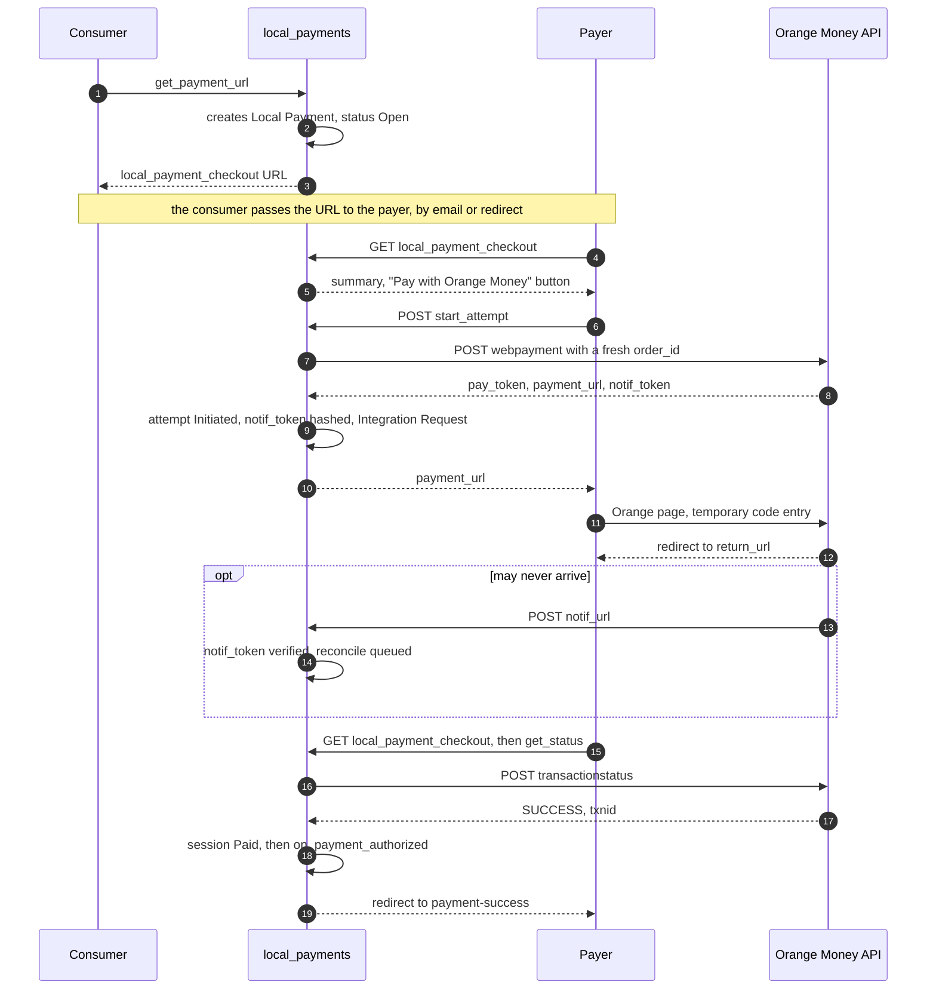

# Orange Money Gateway

This document describes the integration of Orange Money Web Payment into
`local_payments`: configuration, operations called, status mapping, and rules
specific to this provider. Rules common to both gateways (session, attempt,
reconciliation, consumer callback) are in [`../ARCHITECTURE.md`](../ARCHITECTURE.md).

## Product

Orange Money Web Payment, "Group" offer. The payer is redirected to an Orange
page. They generate a temporary code with their secret code, via their
phone's Orange Money USSD service, then enter that code on the page. Orange
advertises the service in Cameroon and several other African countries.

The "Local/USSD" offer sends the request directly to the payer's phone. It
belongs to a different API family and is not covered.

## Merchant prerequisites

- An Orange Money Web Payment contract with Orange Cameroon. The request is
  made to the commercial department (`Partenariat.om@orange.com`), with the
  documents listed on Orange Cameroon's partner page.
- An application on the Orange Developer portal, subscribed to the Web
  Payment API. It provides `client_id` and `client_secret`.
- A merchant key (`merchant_key`), delivered when the contract is activated.

The technical documentation provided to the merchant takes precedence over
this document.

## Configuration

Doctype `Orange Money Settings`, not Single, named by `gateway_name`.

| Field | Type | Required | Role |
| --- | --- | --- | --- |
| `gateway_name` | Data | yes | Contract name. Gives its name to the document and to the `Orange Money-<gateway_name>` gateway. |
| `enabled` | Check | | A disabled gateway refuses `get_payment_url()`. |
| `environment` | Select: Sandbox, Production | yes | Determines the country segment of the URL: `dev` in sandbox. |
| `country_code` | Data | yes | Country segment in production: `cm` for Cameroon. |
| `currency` | Link: Currency | yes | Accepted currency: `XAF` in Cameroon. |
| `api_base_url` | Data | yes | Defaults to `https://api.orange.com`. |
| `client_id` | Data | yes | Orange Developer application identifier. |
| `client_secret` | Password | yes | Application secret. |
| `merchant_key` | Password | yes | Merchant key. |
| `lang` | Select: fr, en | | Language of the Orange page. |
| `reference_label` | Data | | Merchant label shown to the payer on the Orange page. |
| `attempt_validity_minutes` | Int | | Lifetime of a payment token. Defaults to 10. |

The return, cancel, and notification URLs are computed for each attempt from
the site's URL. They are not stored in the settings.

## Operations

`{country}` equals `country_code` in production and `dev` in sandbox.

| Operation | Request | Useful response |
| --- | --- | --- |
| Access token | `POST {api_base_url}/oauth/v3/token`, header `Authorization: Basic base64(client_id:client_secret)`, body `grant_type=client_credentials` | `access_token`, `expires_in` |
| Initiation | `POST {api_base_url}/orange-money-webpay/{country}/v1/webpayment`, Bearer token. Body: `merchant_key`, `currency`, `order_id`, `amount`, `return_url`, `cancel_url`, `notif_url`, `lang`, `reference` | `201`: `pay_token`, `payment_url`, `notif_token` |
| Status | `POST {api_base_url}/orange-money-webpay/{country}/v1/transactionstatus`, Bearer token. Body: `order_id`, `amount`, `pay_token` | `status`, `order_id`, `txnid` |
| Incoming notification | `POST` on `notif_url` | `status`, `notif_token`, `txnid` |

## Status mapping

| Orange status | Attempt status | Note |
| --- | --- | --- |
| `INITIATED` | `Initiated` | The payer has not yet validated. |
| `PENDING` | `Pending` | Validation received, processing under way. The move to a final state is quick. |
| `SUCCESS` | `Succeeded` | |
| `FAILED` | `Failed` | |
| `EXPIRED` | `Expired` | Validation arrived after the token expired. |
| `INITIATED` after `attempt_validity_minutes` + 5 minutes | `Expired` | An expired token can no longer succeed. |
| `PENDING` after `attempt_validity_minutes` + 5 minutes | `Unresolved` | Queried thereafter at decreasing frequency. |

## Flow

## Rules specific to Orange Money

- **`order_id`.** Orange only accepts one token per `order_id` (error 1204).
  The field receives the `attempt_id`, generated for each attempt: a prefix
  followed by 20 hexadecimal characters. The consumer's document name is
  never used.
- **Amount.** Sent as an integer. XAF has no subunit.
- **`notif_token`.** Received at initiation and stored hashed. The
  notification URL carries the `attempt_id` as a parameter. A notification
  whose token does not match the attempt's is ignored, with no outbound call.
- **Amount verification.** The status response does not return the amount.
  The status request sends the session's amount, and compliance relies on
  this parameter.
- **`txnid`.** Transaction number sent to the payer by SMS. It is stored in
  `provider_transaction_id` and shown on the session for support.
- **Return and cancel.** `return_url` and `cancel_url` point to the session's
  payment page. They do not change any state by themselves: the page calls
  `get_status()` on load.
- **Reuse.** As long as an attempt is `Initiated` and not expired, the page
  returns its `payment_url` instead of creating a new one.
- **Access token.** Cached per settings document until `expires_in` minus 60
  seconds. Renewed on a 401 response, with a single retry.

## Known errors

| HTTP code / API code | Meaning | Handling |
| --- | --- | --- |
| `401` | Access token expired or invalid | Token renewal, then a single retry. |
| `403` / `50` | Access denied: application or country not authorized | Attempt `Error`. Configuration alert. |
| `403` / `1202` | Invalid merchant key | Attempt `Error`. Configuration alert. |
| `403` / `1203` | Currency not authorized for the country | Attempt `Error`. Configuration alert. |
| `403` / `1204` | `order_id` already used | Attempt `Error`. Does not occur if `attempt_id` is unique. |
| Timeout at initiation | No `pay_token`, so no queryable or payable transaction | Attempt `Error`. The payer can retry. |

## Points to confirm before production

| Point | Assumption made | Effect if the assumption is wrong |
| --- | --- | --- |
| Endpoints and credentials after the technical migration forced by Orange Money in Cameroon | `api.orange.com` and the paths above | Change of `api_base_url` and of `providers/orange_money.py`. |
| Payment token lifetime | 10 minutes | Adjust `attempt_validity_minutes`. |
| Notification schema | `status`, `notif_token`, `txnid` | Adapt token verification. Confirmation does not depend on the notification. |
| Rejection of a different `amount` by `transactionstatus` | Orange rejects the request | Amount verification is incomplete. |
| Currency code in sandbox | Orange's own test code, different from `XAF` | Adjust the mapping in the client. |
| Accepted format for `order_id` (length, characters) | Alphanumeric, at most 30 characters | Adjust the `attempt_id` generator. |
| Minimum and maximum amounts per transaction | None | Add `validate_minimum_transaction_amount()` and a maximum rejection. |

## References

| Source | Nature | Content used |
| --- | --- | --- |
| Orange Developer, "Orange Money Web Payment / M Payment": overview and FAQ — `developer.orange.com/apis/om-webpay` | Official | Payer journey, covered countries, access conditions. |
| Orange Cameroun, "Partenaire Webpayment" — `orange.cm/fr/om-partenaires/partenaire-webpayment.html` | Official | Contractual process. |
| Y-Note, "Comment déployer l'API Orange Money Groupe / Web ?" — `y-note.cm/comment-deployer-lapi-orange-money/` | Integrator partner of Orange Cameroon | Requests, production and sandbox URLs, notification content. |
